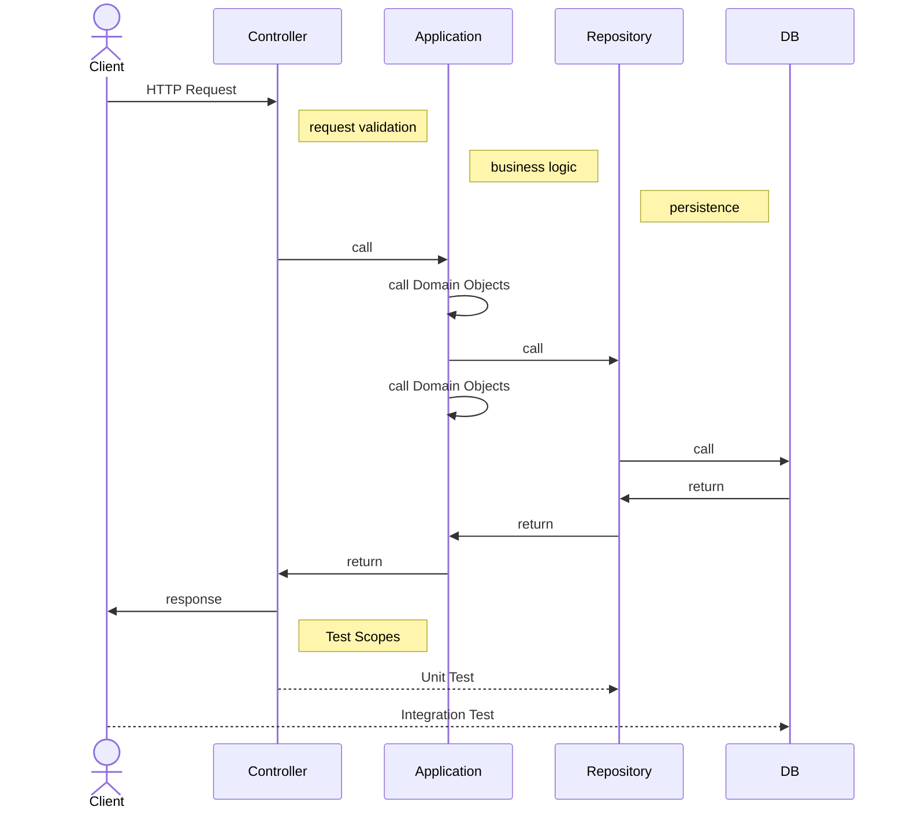

# Metrics Api

This api handles data storage, retrieval, and manipulation, enabling the frontend to present graphical representations of metrics over time.

## Documentation

The `docs` directory contains important documentation for the project:

- `docs/requests/request-example.rest`: Example REST API requests that can be executed using the VSCode REST Client extension.

## Run project on local

This project requires a MongoDB server. Once the mongo server is running is possible to run the project on developer mode:

```
npm run dev
```

of build the project

```
npm install
npm run build
npm start

```

Alternative a ``docker-compose` file is provided to create a Docker container with these dependency. To start the service, run:

```
docker-compose up -d
```

s
In either scenario, your application should now be reachable via http://localhost:3000.

## Testing

- For unit tests (using Jest):

```
npm run test:unit

```

- For integration tests (using Cucumber and supertest):

```
npm run test:integration
```

Integration tests will verify the database connection, **Database service should be active for running this test**

It is possible to launch all test together with

```
npm run test

```

# Architecture overview


