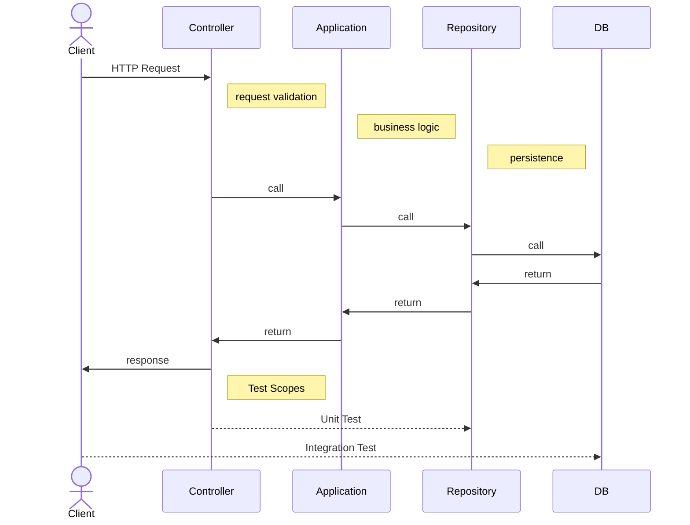

# Architecture

```mermaid
sequenceDiagram
    actor U as Client
    participant C as Controller
    participant S as Application
    participant R as Repository
    participant DB
    U->>C: HTTP Request
        Note right of C: request validation
        Note right of S: business logic
        Note right of R: persistence
    C->>S: call
    S->>R: call
    R->>DB: call
    DB->>R: return
    R->>S: return
    S->>C: return
    C->>U: response
    Note right of C: Test Scopes

    C-->>R: Unit Test
    U-->>DB: Integration Test


```
